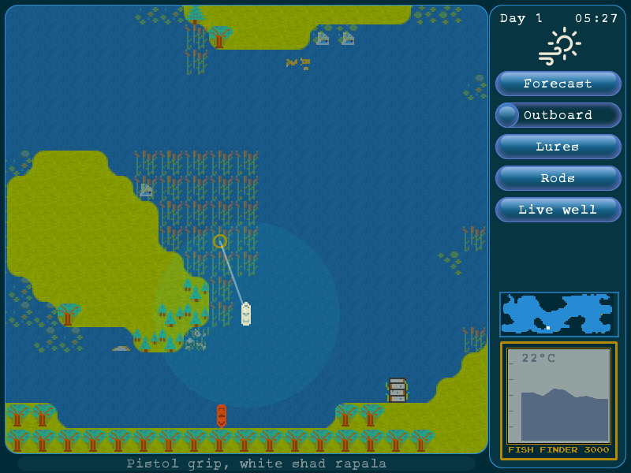
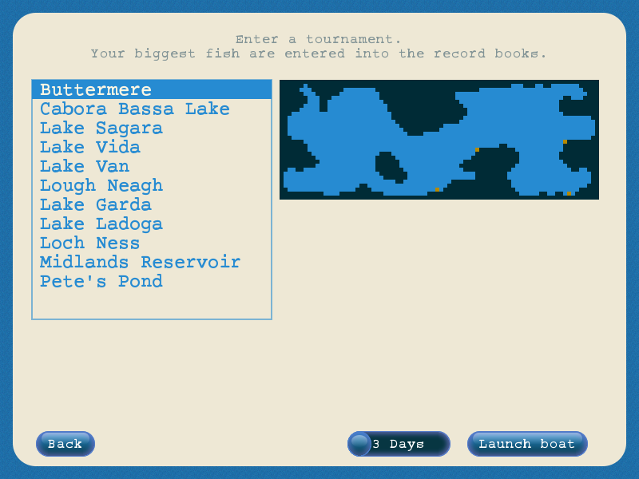
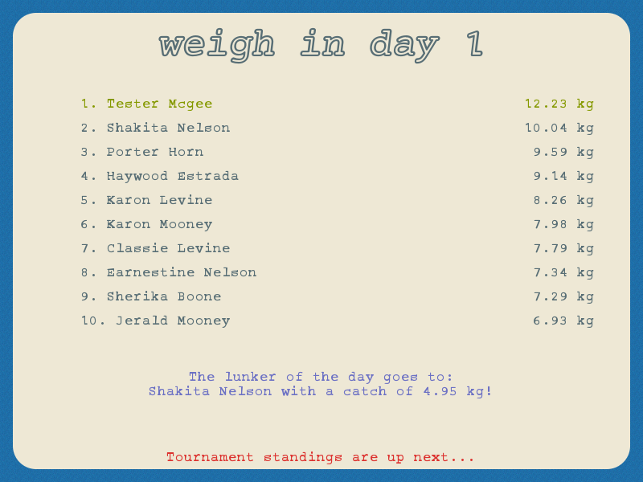

Bass lover is a fun fishing game where you enter a 3 day fishing tournament to catch the biggest fish. The game is strategic based as opposed to action based: time passes with turns, and success is determined by weather conditions, your lure selection and sometimes a little luck. 

