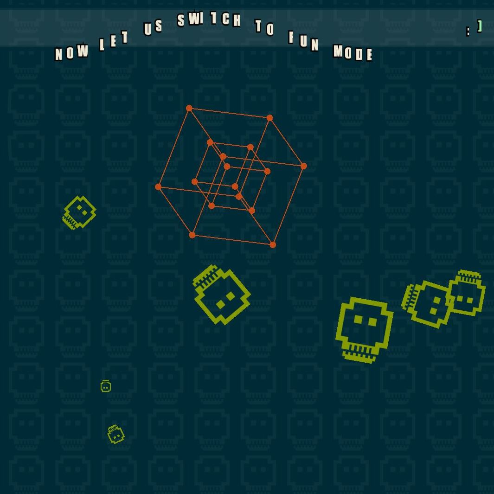

This is a browser based WebGL demo that displays a collection of random visual effects. The idea is to give a transition between visual styles through a constantly changing canvas.

In addition to giving a sensory experience, this project aims to provide a modular design to easily add new demolets. 

This project uses WebGL and the Pixi library.

