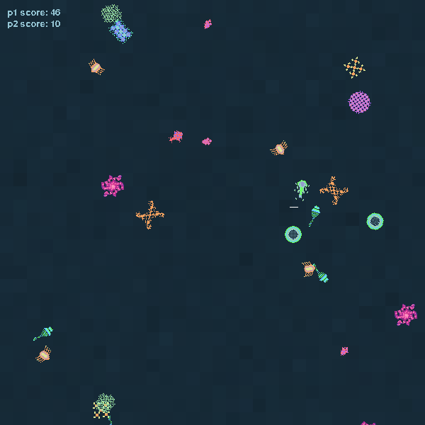

Microbes was created in half a day for Ludum Dare 27, 2013.

* you are a microbe with a 10 second lifespan.
* eat green/blue microbes to extend your life.
* avoid red/pink microbes who steal your life.
* score is determined by the number of seconds you stay alive, plus the amount of microbes you ate.
* two player hotseat for your friends.

To play the game you need to install [Love2D](https://love2d.org/).

