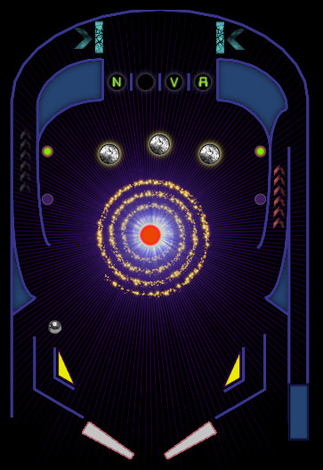

_Copyleft 2015 Wesley Werner_

**Your mission**: Make the star go nova. There are in-game hints that point out the next target to achieve your goal.

# HOW TO PLAY

* The `UP`, `DOWN` and `SPACE` keys navigate the menus.
* The `LEFT` + `RIGHT SHIFT` keys control the flippers
* The `SPACE` key launches the ball.
* `SPACE` also nudges the table if a ball is in play.
* If you nudge too much the table will tilt.

# TABLE FEATURES

* Missions: Target goal hints are given during play, in the LED display and as flashing table lights (configurable in settings).
* Safe Mode: A 30 second grace period where a free ball is launched on a drain.
* Multi-ball: Complete the "Matter Jettison" mission to release the second bonus ball.
* Tilt: You don't score points and the flippers won't move until a ball is drained.

