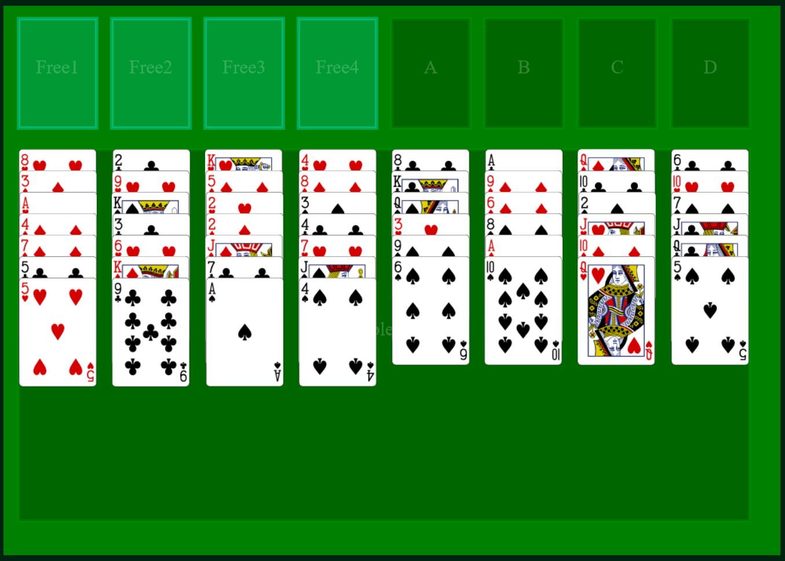
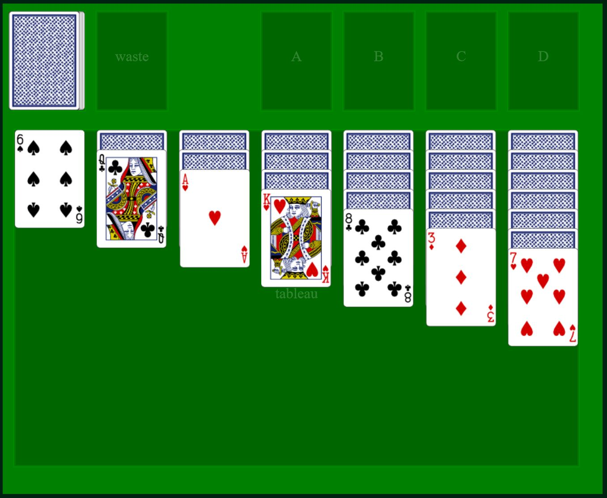

You can choose between these card games:

* Klondike, one of the most widely known solitaire games.
* Freecell
* Doppelganger, A patience card game created by "unpronounceable" for Ludum Dare 35.

Features:
* Drag and drop cards to move them
* Mobile friendly
* Each game has a playing guide (click the questionmark button)
* Keeps a history of games played (saved in local browser storage only)
* Replay a game by entering the game number

Penny farthing is a solitaire card game engine using a web canvas and pure vanilla JavaScript.

For details on it's implementation and how to make your own card game rules, see the [WIKI](https://github.com/wesleywerner/penny-farthing/wiki).

