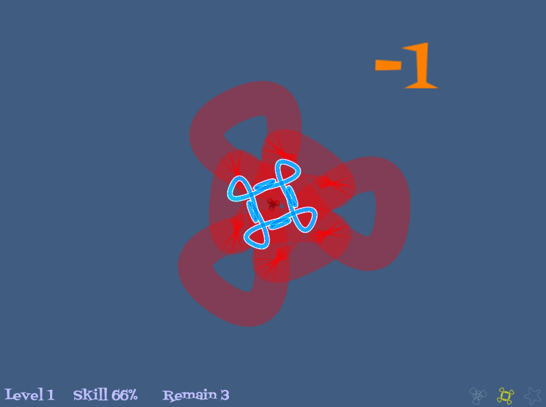

A simple polygon shape-shifting game created for Ludum Dare 35, with theme of "Shapeshift". The built-in quick-start tutorial gets you going. Try for yourself and see what rank you are given.

The Love file requires LÖVE 0.10.1

Tools used:

- Code: Löve 0.10.1 (www.love2d.org)
- Inkscape: Shape Generation (https://inkscape.org)
- Sounds: Sfxr (http://www.drpetter.se/project_sfxr.html)
- Music: Milkytracker (http://milkytracker.org)

The song is called "polyshift" and created by me for this game entry.