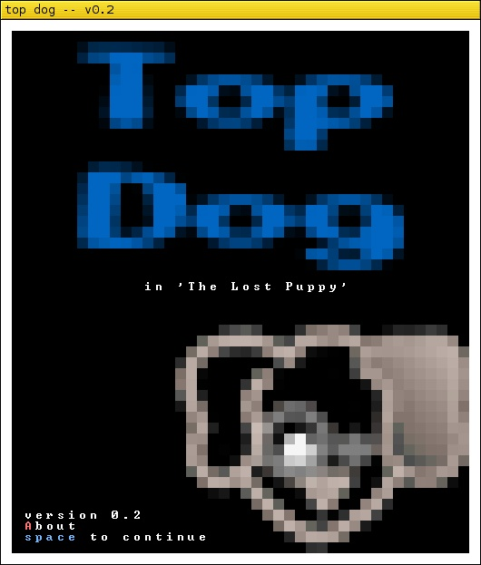
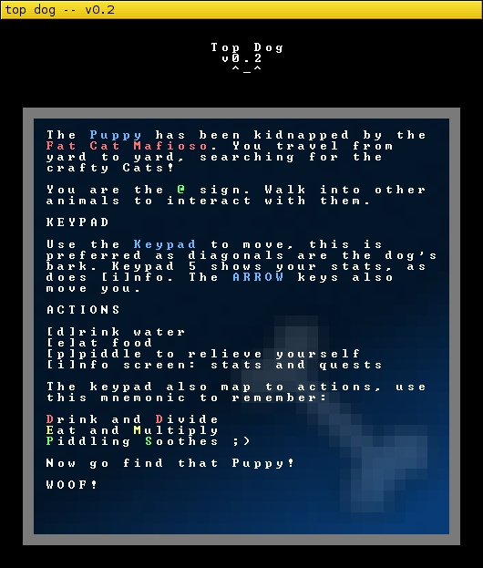
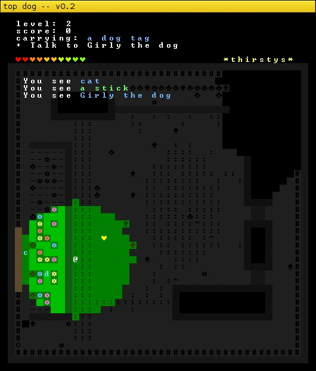
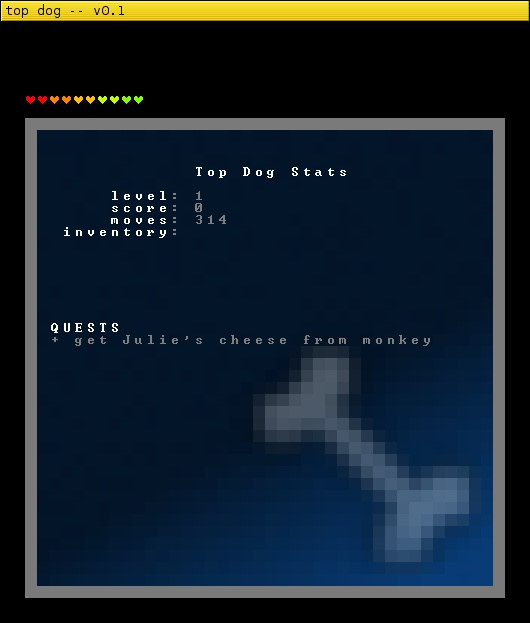
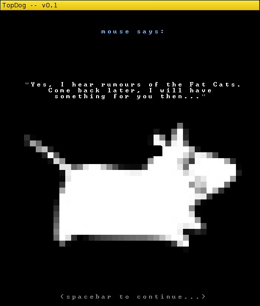

TopDog is a Roguelike game I created in seven days for the 2012 7DRL competition.

The story is that The Puppy has been kidnapped by the Fat Cat Mafioso. You travel from yard to yard, searching for the crafty Cats holding her hostage. Along the way you meet other animals and find treats and toys. It has a basic quest and rewards system.

